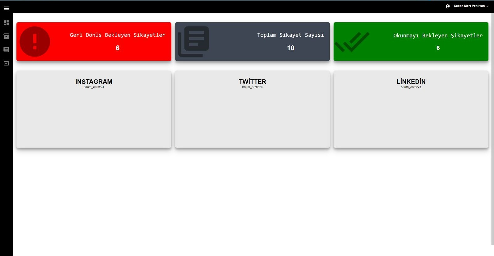

## Dashboard

## Project Name: Complaint Portal

# Project Purpose:

The purpose of this project is to create a portal that enables a company to easily manage customer complaints. The portal provides a web interface for customers to write their complaints and an admin panel for company managers to track and resolve the complaints.

# Project Features:

Customers can write their complaints on the portal through a web form. The form includes the customer's name, email address, phone number, and details of their complaint. Customers can also choose to receive a response by email by checking a box on the form.
An admin panel is available to track complaints. In this panel, managers can categorize, prioritize, and monitor the complaint resolution process. They can also manage customer information.
The admin panel provides many reporting tools for tracking complaints. Managers can obtain statistics on customer complaints and use this data to improve their business processes.
The portal is fully customizable and can be adapted to the needs of the company.

# Project Benefits:

The Complaint Portal helps companies effectively manage customer complaints. This increases customer satisfaction and maintains the company's reputation.
The portal makes it easier for managers to track and resolve complaints. This makes business processes more efficient and saves time and resources.
The admin panel helps managers manage their work better and increases the efficiency of the company.
This project provides a solution to help companies better manage customer complaints. The Complaint Portal helps companies provide better service to their customers and makes business processes more efficient. It also provides an option for customers to receive feedback on their complaints
